# Axiom Consultants
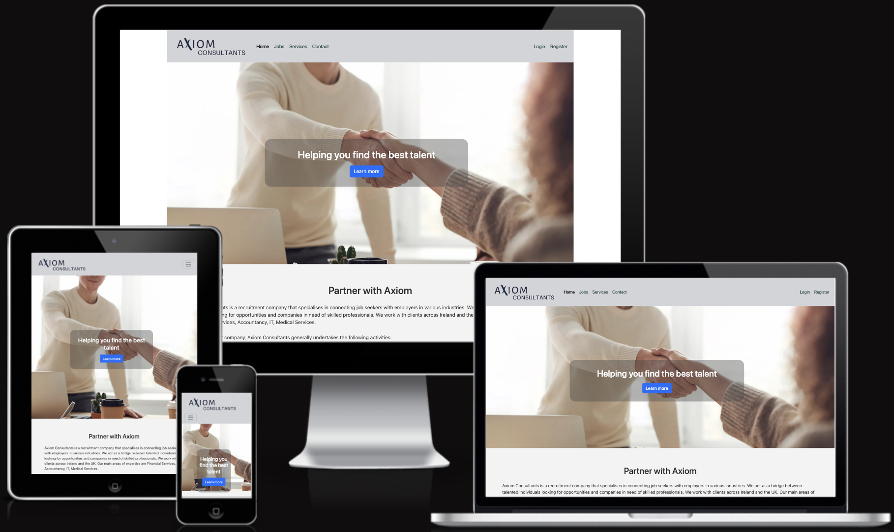

[Repository](https://github.com/steve-doc/axiom)


[Live site](https://axiom-recruitment-f7943c5e25ff.herokuapp.com/)

## Table of contents
1. [Introduction](#introduction)
2. [UX](#ux)
3. [User Stories](#user-stories)
4. [Wireframes](#wireframes)
5. [Features](#features)
6. [Technology Used](#technology-used)
7. [Database Design](#database-design)
8. [Agile Development Process](#agile-development-process)
9. [Testing](#testing)
10. [Accessibility Features](#accessibility-features)
11. [Deployment](#deployment)
12. [Credits](#credits)
13. [Acknowledgements](#acknowledgements)


## Introduction

The Axiom Consultants website is designed to showcase the services of a real recruitment company. The [current website](https://axiomconsultants.ie/) of the company  is dated, broken in places and, in particular, jobs cannot be created without involving the developer.

Users can register for the site, which will store their details.  This will provide CRUD functionality on their own job posts.

From the Home page users can peruse through an abbreviated description of services with the option of clicking through to more detailed descriptions on the services page.

On the Jobs page users can see a list of available jobs.  Each of these jobs can be selected and a more detailed view of the jobs is then displayed.  If the user is registered and logged in they are presented with the ability to post new jobs and edit/delete jobs they have already posted.  Users that have been designated as staff by the admin can edit/delete all posts.  Rich text editing functionality is provided to enhance the presentation of the job posts.

This project significantly enhances the functionality of the client’s existing site in a number of ways.  Firstly, their site is poorly formatted, not responsive and has very slow performance.  Also the client does not currently have any Content Management (CMS) capability to add their own job posts and incurs charges whenever a new job has to be posted, updated or removed.

The new site is completely responsive, has a sharp fresh design and allows complete CRUD capability to staff and limited CRUD capability to potential clients. 

There is significant potential to expand the site in the future to include, for example, a candidate database story CVs, the ability to apply for jobs and potentially post jobs to LinkedIn using their developer API.  Unfortunately, we weren’t able to gain access to that API at the point of completing the project.

## UX

### Colour Scheme

In discussion with the client it was agreed to use strong thematic images to provide visual impact on the pages so wanted neutral colours that would not clash with the images.  The Headers, Footers and card backgrounds use #D1D4D9 and the main body is in the lighter #F3F3F3 to provide contract through the sections.  The HTML is coloured white to provide a contrast to the edges of the website at larger screen sizes that exceed the maximum width that has been defined for the site.  These were matched using the [ColorSpace](https://mycolor.space/) palette matching website.

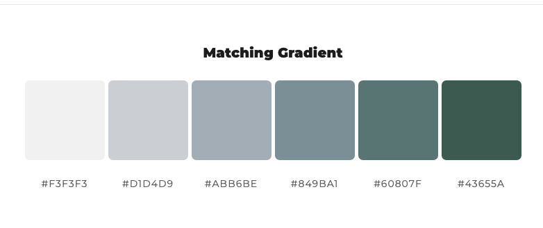
On the services page, where we have the detailed service descriptions, we have added a fixed background image to bring some dramatic impact to the pages as we have not used images on the detailed services cards.

### Typography

Having installed Bootstrap for this project, the default “native font stack” included in Bootstrap has been used.  This provides optimised fonts for the most popular device types and Operating Systems.  In addition these fonts are responsive and working will across the range of viewports defined within the framework.
[Bootstrap Typography](https://getbootstrap.com/docs/5.3/content/typography/)


## User Stories

I have organised my user stories into thematic **Epics**
### Epic - [Core Functionality](https://github.com/steve-doc/axiom/issues/9)

- As a site owner I want to **create a base template** so that I can **create and maintain core functions such as navigation and messaging in one place and not repeat them on every page** [Link](https://github.com/steve-doc/axiom/issues/22)

- As a **User** I want to **engage with navigation bar** so that I can **easily move from page to page** [Link](https://github.com/steve-doc/axiom/issues/11)

- As a **User** I want to **see some feedback messaging when I update posts or profile** so that I can **know whether or not the action was successful** [Link](https://github.com/steve-doc/axiom/issues/17)

- As a **User** I want to **additional information at the foot of the page** so that I can **access navigation etc without having to scroll back to the top of pages** [Link](https://github.com/steve-doc/axiom/issues/20)

### Epic - [Job Postings](https://github.com/steve-doc/axiom/issues/1)

- As a **User or staff member** I want to **view a list of jobs** so that I can **decide which jobs I want to engage with** [Link](https://github.com/steve-doc/axiom/issues/5)

- As a **user or staff member** I want to **add new job postings** so that I can **add new jobs for others to view** [Link](https://github.com/steve-doc/axiom/issues/3)

- As a **User or staff member** I want to **be able to edit the content of a job post** so that I can **display the most up to date information** [Link](https://github.com/steve-doc/axiom/issues/4)

- As a **User or staff member** I want to **be able to delete a job post** so that I can **remove job posts that are no longer valid** [Link](https://github.com/steve-doc/axiom/issues/10)

### Epic - [Users](https://github.com/steve-doc/axiom/issues/2)

- As a **User** I want to **be able to register for the site** so that I can **login in and create job posts** [Link](https://github.com/steve-doc/axiom/issues/14)

- As a **User** I want to **be able to log in to site** so that I can **create and edit job posts** [Link](https://github.com/steve-doc/axiom/issues/21)

- As a **User** I want to **log out from site** so that I can **others cannot edit my information** [Link](https://github.com/steve-doc/axiom/issues/16)

- As a **User** I want to **be able to amend my profile details** so that I can **have the most recent profile information** [Link](https://github.com/steve-doc/axiom/issues/15)

### Epic - [Home Page](https://github.com/steve-doc/axiom/issues/7)

- As a **User** I want to **view and engaging image on the home page** so that I **find the page interesting and be introduced to what the site is about** [Link](https://github.com/steve-doc/axiom/issues/18)

- As a **User** I want to **see some short messages explaining the company service** so that I can **decide which service are relevant to me** [Link](https://github.com/steve-doc/axiom/issues/19)

### Epic - [Contact Page](https://github.com/steve-doc/axiom/issues/6)

- As a **User** I want to **enter my details into a form and submit** so that I can **be contact for further information on a topic** [Link](https://github.com/steve-doc/axiom/issues/24)

- As a **User** I want to **view an interesting page heading within an engaging image** so that I can **clearly identify what page I am on** [Link](https://github.com/steve-doc/axiom/issues/23)

### Epic - [Services Page](https://github.com/steve-doc/axiom/issues/8)

- As a **User** I want to **view services descriptions** so that I can **understand what the company can do for me** [Link](https://github.com/steve-doc/axiom/issues/26)

- As a **User** I want to **view an interesting page heading within an engaging image** so that I can **clearly identify what page I am on** [Link](https://github.com/steve-doc/axiom/issues/25)


## Wireframes

Wireframes have been produced using [Figma](https://www.figma.com/file/O8JAL46OdCJH5ZrVO6Ie9x/Axiom?type=design&node-id=0%3A1&mode=design&t=9b1wHrEOAMbPun55-1)

### Home Page


### Jobs Page


### Services Page


### Contact Page

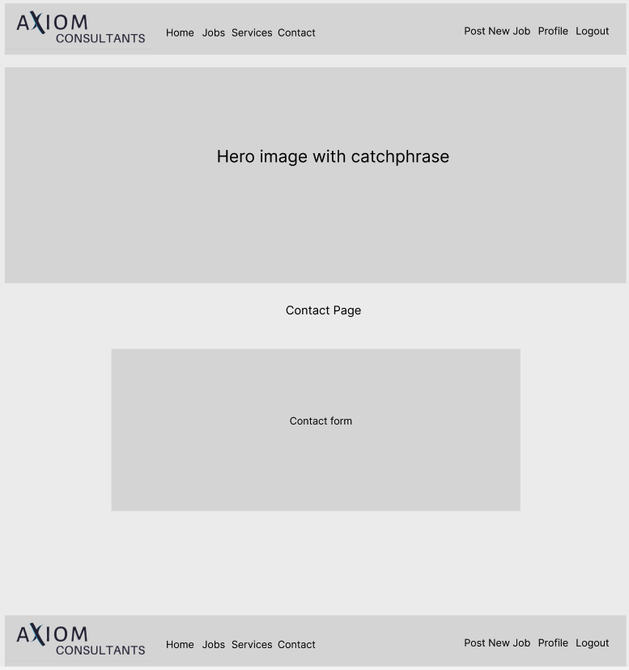


## Features

### Existing Features

- **Navigation**
    - The navigation bar is located both at the top and bottom of the screen and is split into a left and right section.
    - The left section allows navigation between the individual pages on the site.
    
    - The right section initially displays login and register choices.  After login these option disappear and are replaced with options to Post a new job, Profile and Logout.
    
    - Navigation is also included in the footer of the page.  Here we have added links to social networks and the company address.
    
    Navigation is responsive and changes to a "Burger" style button on smaller screens.  This expands to chow full navigation menu on selection.
    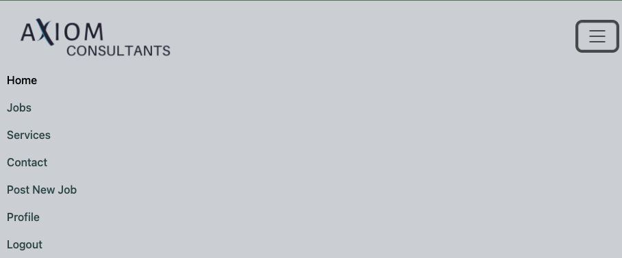
    - Active page - Because we have the navigation in the base template we have injected the active bootstrap class in navigation in the base template from each of the destination pages using jinja block notation (e.g. )

- **Home Page**
    - The home page is divided into 3 sections - Hero, Intro & Service Intros
    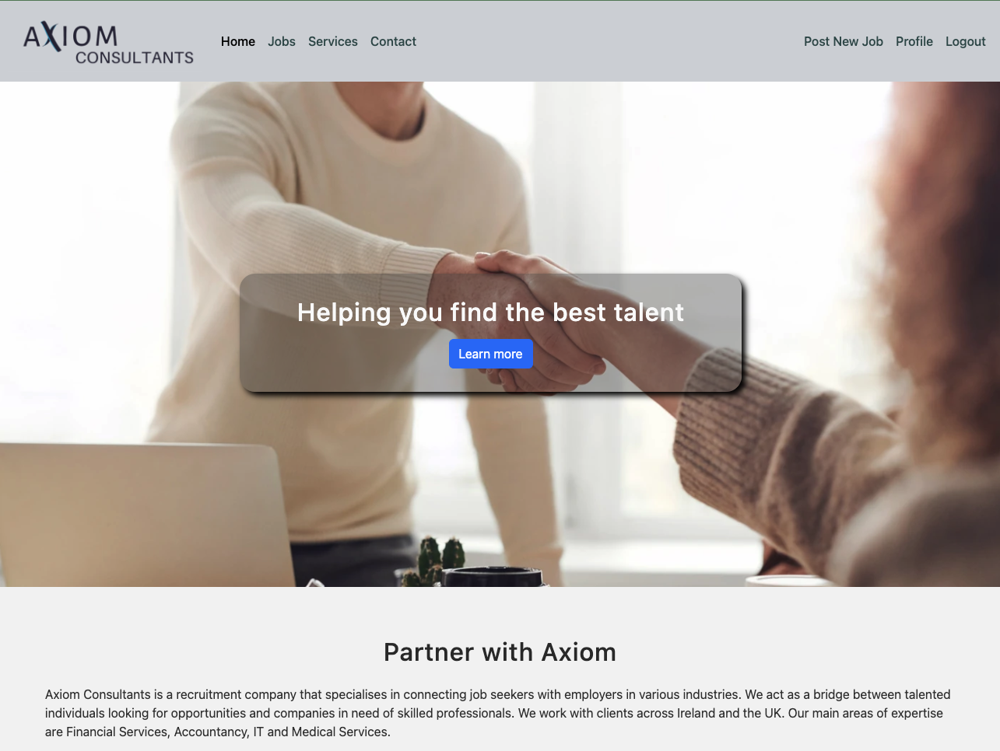
    - Hero Image - This image is repeated on each page and shows a meeting or agreement. In the center of here on home page is a tagline of the company and a button to click on if you want to find out more.  The button brings you to the services page
    - Intro - 3 paragraph the explain the company's approach
    - Service Intros - 6 'cards'.  Each card has an appropriate image. Title abd brief description of each of the company services and a button linking directly to a more detailed description of each service on the services page. These cards are responsive, displayed in 3 columns and 2 rows on large screens, moving to full width cards on smaller screens.
    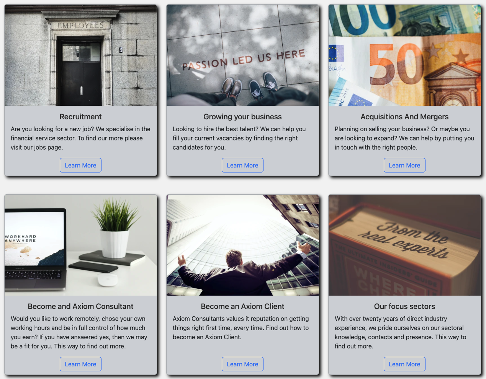

- **Jobs Page**
    - The jobs page is where we list all the available jobs that have ben created via the Post New Job link on the Navbar.  
    - **To facilitate the project evaluators being able to test the full functionality of the site we have set up the application to allow anyone who is registered to post new jobs.  However, in production we would limit job posting to users designated as "staff" by the administrator.  Currently post creators and staff have CRUD functionality on job posts.**
    - Post New Job - the option can be access from any page from the navigation bar, as long as the user is logged in.  This link takes you to the Job Posting page. We have integrated Summernote into this form to facilitate rich text editing within the description and Skills input areas.
    
    - The jobs page is split into the hero title at the top and the list of job postings at the bottom.
    - Jobs Page Hero/Title - Consistent image with front page but with different title inviting users to view current job opportunities. 
    
    - Job Listings - Setup to show essential details of each job posting. Automated pagination setup at 5 jobs per page. Job detail is accessed by clicking on the job title.
    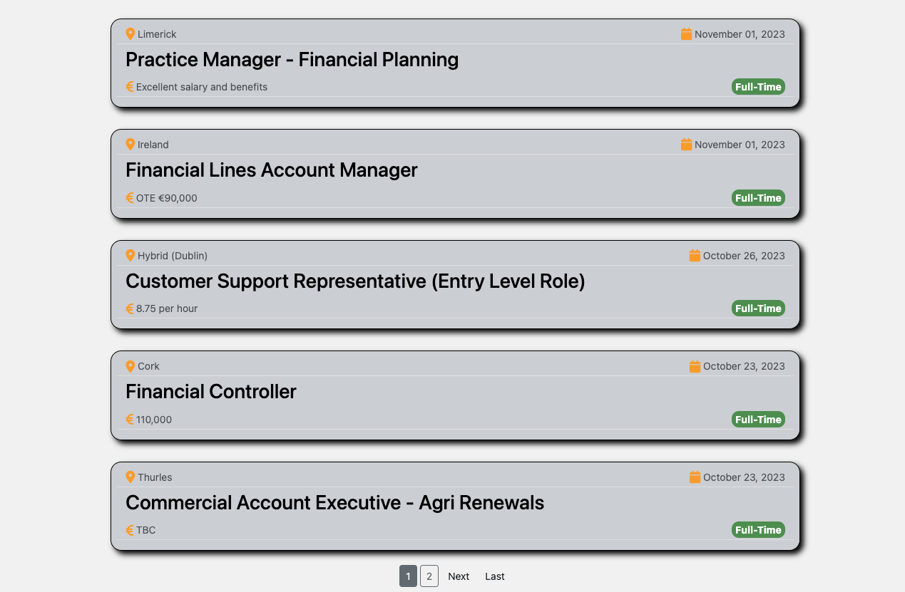
    - Job Detail - A detailed view of all the job fields. 
    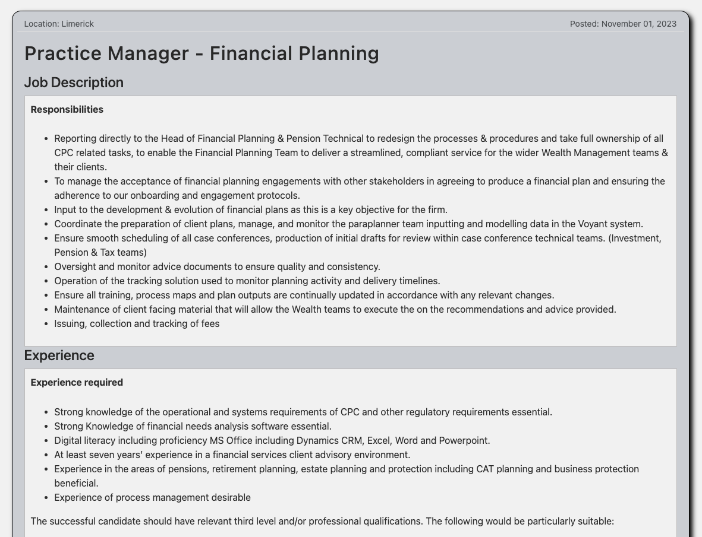
    - if the job post was created by the current user or they are designated as a member of staff by the admin the user is presented with Update and Delete buttons at the bottom of this page.
    
    - if update is selected the user is taken to a form, prepopulated with the selected job post data and can edit the post. Similar to the Post new Job screen the option is at the bottom of the post to post again and the Summernote rich text editing is available
    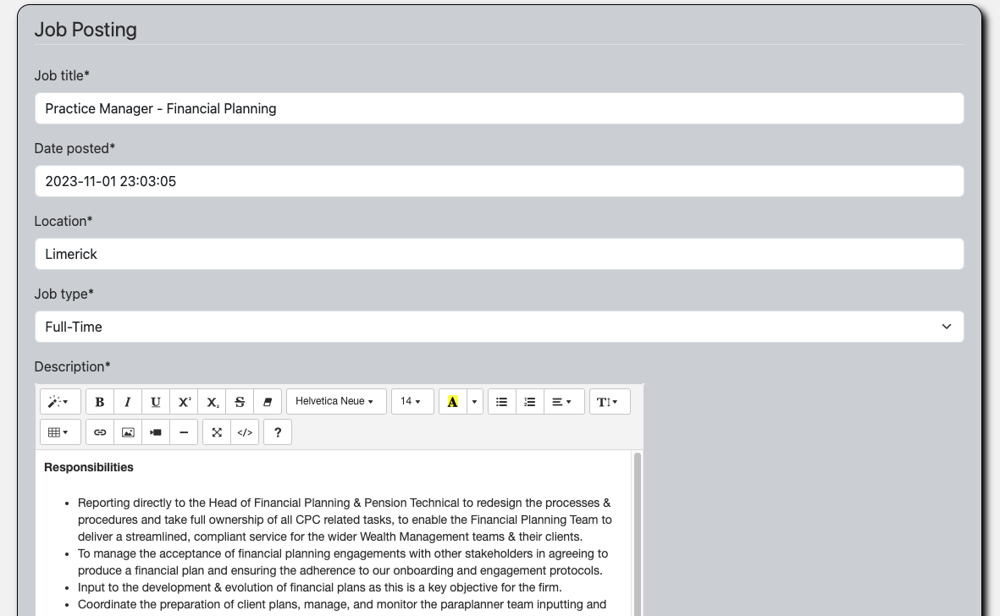
    - If the user choses to delete the job post they are presented with a warning page before the job is finally deleted.
    

- **Services Page**
    - The Service page again retains the same familiar heo image but with the page title at the center.
    
    - Detailed descriptions of the services are on larger cards.  We have not included the card images here but have, instead put a background image behind the cards to provide some colour. These cards are responsive, displayed in 2 columns and 3 rows on large screens, moving to full width cards on smaller screens.
    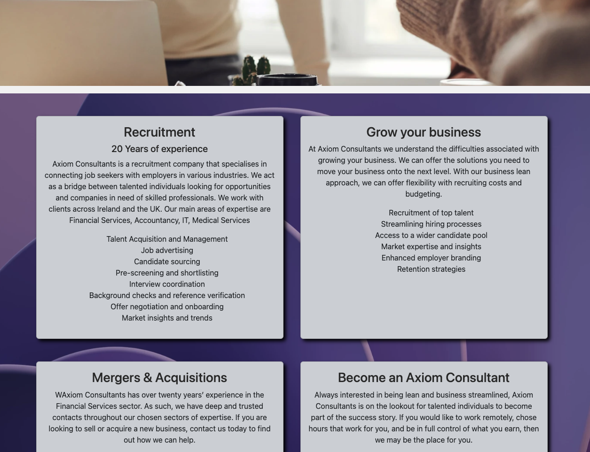
- **Contact Page**
    - Contact page uses the same hero image are the home page with a tagline message and button taking you to more information on the services page.  Can clearly see the contact form below to image to ensure the user knows what page the are on.

    - Contact form allows the to enter their details and a message.  On submit this triggers an email with the the details to the inbox of the company.

- **Registration**
    - A new user can register for the site from the navigation bar from any page.  This form tests that valid email and secure passwords are provided before allowing the user to complete registration.
    
- **Login**
    - A user can login to the site from the navigation bar from any page. Whe the user is logged in the can then post new jobs and edit jobs they have already posted.
    
- **Logout**
    - A user can logout nd is presented with the following screen.
    
- **Profile**
    - While logged in a user can update their user profile, with the ability to also add or change their profile picture.
    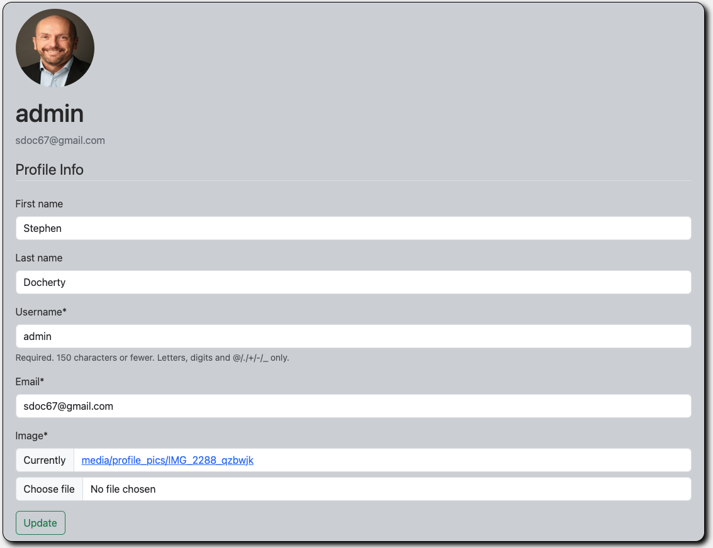


### Future Features

- **Candidates database**
    - The navigation bar is located both at the top and bottom of the screen
- **Job archival**
    - The ability to keep the job post but remove it from the current available jobs.  Would allow staff to re-post or re-use old jobs.
- **Apply for job**
    - The home page
- **Job candidates**
    - The home page
- **Candidate and Jobs filtering**
    - The navigation bar is located both at the top and bottom of the screen
- **Integration with LinkedIn**
    - The home page
- **Insights Page**
    - The home page

## Technology Used

- [HTML](https://en.wikipedia.org/wiki/HTML) used for the main site content.
- [CSS](https://en.wikipedia.org/wiki/CSS) used for the main site design and layout.
- [CSS Flexbox](https://www.w3schools.com/css/css3_flexbox.asp) used for an enhanced responsive layout.
- [CSS Grid](https://www.w3schools.com/css/css_grid.asp) used for an enhanced responsive layout.
- [Python](https://www.python.org) used as the back-end programming language.
- [Git](https://git-scm.com) used for version control. (`git add`, `git commit`, `git push`)
- [GitHub](https://github.com) used for secure online code storage.
- [Gitpod](https://gitpod.io) used as a cloud-based IDE for development.
- [Bootstrap](https://getbootstrap.com) used as the front-end CSS framework for modern responsiveness and pre-built components.
- [Django](https://www.djangoproject.com) used as the Python framework for the site.
- [PostgreSQL](https://www.postgresql.org) used as the relational database management.
- [ElephantSQL](https://www.elephantsql.com) used as the Postgres database.
- [Heroku](https://www.heroku.com) used for hosting the deployed back-end site.
- [Cloudinary](https://cloudinary.com) used for online static file storage.
- [Gunicorn](https://gunicorn.org/) used as a server provider for the site.
- [dbdiagram.io](https://dbdiagram.io/) used to design database schema.
- [Gimp](https://www.gimp.org/) - used for sizing of images.

## Database Design

[PostgreSQL](https://www.postgresql.org) has been used as the relational database for deployment, hosted using [ElephantSQL](https://www.elephantsql.com).  To model the database I used [dbdiagram.io](https://dbdiagram.io/d/Axiom-65365b24ffbf5169f041a7be) to create the Entity Relationship Diagram to visualise the relationship between the 3 tables required.


- **users**
    - importing django user model
    - one to one relationship with profile table
    - one to many relationship 
- **profile**
    - custom model with one to one relationship with users table
    - has one field (other than ID) storage of profile image

- **job**
    - custom model for storage of job postings
    - many to one relationship with users table (many jobs per user)
    - Presets defined in model for job_type field.


## Agile Development Process
Agile Development methodology was used to organise the workflow of developing this application.  Using the Epics and User stories described in the User Stories Section above.  Tasks were described for each user story and also acceptance criteria which were used in the testing methodology.

### GitHub Projects

[Github Projects](https://github.com/users/steve-doc/projects/4/views/1) was used as the tool to develop a kanban board to organise the workflow into To Do, In Progress and Done.


The Epics and User Stories were linked to organise the development flow into focused sprints.

#### Epic
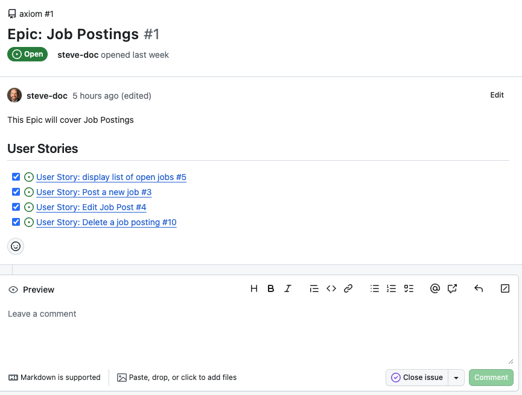
#### User Story
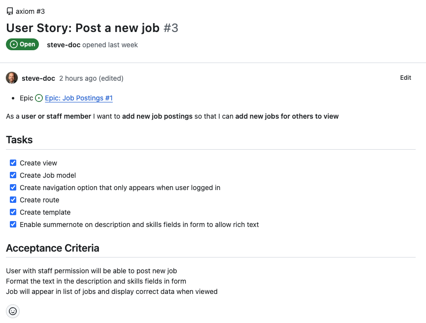

## Testing

Please refer to [testing.md](testing.md)

## Accessibility Features

* All images have alt labels
* Any links that take user to external website have aria labels
* Care has been taken to ensure good contrast between text and back ground colors
* Have used semantic html throughout

## Deployment

The live deployed application can be found deployed on [Heroku](https://axiom-recruitment-f7943c5e25ff.herokuapp.com/).

### ElephantSQL Database

This project uses [ElephantSQL](https://www.elephantsql.com) for the PostgreSQL Database.

To obtain your own Postgres Database, sign-up with your GitHub account, then follow these steps:
- Click **Create New Instance** to start a new database.
- Provide a name (this is commonly the name of the project: venezuelan-food-cookbook).
- Select the **Tiny Turtle (Free)** plan.
- You can leave the **Tags** blank.
- Select the **Region** and **Data Center** closest to you.
- Once created, click on the new database name, where you can view the database URL and Password.

### Cloudinary API

This project uses the [Cloudinary API](https://cloudinary.com) to store media assets online, due to the fact that Heroku doesn't persist this type of data.

To obtain your own Cloudinary API key, create an account and log in.
- For *Primary interest*, you can choose *Programmable Media for image and video API*.
- Optional: *edit your assigned cloud name to something more memorable*.
- On your Cloudinary Dashboard, you can copy your **API Environment Variable**.
- Be sure to remove the `CLOUDINARY_URL=` as part of the API **value**; this is the **key**.

### Heroku Deployment

This project uses [Heroku](https://www.heroku.com), a platform as a service (PaaS) that enables developers to build, run, and operate applications entirely in the cloud.

Deployment steps are as follows, after account setup:

- Select **New** in the top-right corner of your Heroku Dashboard, and select **Create new app** from the dropdown menu.
- Your app name must be unique, and then choose a region closest to you (EU or USA), and finally, select **Create App**.
- From the new app **Settings**, click **Reveal Config Vars**, and set your environment variables.

| Key | Value |
| --- | --- |
| `CLOUDINARY_URL` | user's own value |
| `DATABASE_URL` | dj_database_url.parse(os.environ.get("DATABASE_URL")) |
| `DISABLE_COLLECTSTATIC` | 1 (*this is temporary, and can be removed for the final deployment*) |
| `SECRET_KEY` | os.environ.get('SECRET_KEY') |

Heroku needs two additional files in order to deploy properly.
- requirements.txt
- Procfile

You can install this project's **requirements** (where applicable) using:
- `pip3 install -r requirements.txt`

If you have your own packages that have been installed, then the requirements file needs updated using:
- `pip3 freeze --local > requirements.txt`

The **Procfile** can be created with the following command:
- `echo web: gunicorn app_name.wsgi > Procfile`
- *replace **app_name** with the name of your primary Django app name; the folder where settings.py is located*

For Heroku deployment, follow these steps to connect your own GitHub repository to the newly created app:

Either:
- Select **Automatic Deployment** from the Heroku app.

Or:
- In the Terminal/CLI, connect to Heroku using this command: `heroku login -i`
- Set the remote for Heroku: `heroku git:remote -a app_name` (replace *app_name* with your app name)
- After performing the standard Git `add`, `commit`, and `push` to GitHub, you can now type:
	- `git push heroku main`

The project should now be connected and deployed to Heroku!

### Local Deployment

This project can be cloned or forked in order to make a local copy on your own system.

For either method, you will need to install any applicable packages found within the *requirements.txt* file.
- `pip3 install -r requirements.txt`.

You will need to create a new file called `env.py` at the root-level,
and include the same environment variables listed above from the Heroku deployment steps.

Sample `env.py` file:

```python
import os

os.environ.setdefault("CLOUDINARY_URL", "user's own value")
os.environ.setdefault("DATABASE_URL", "user's own value")
os.environ.setdefault("SECRET_KEY", "user's own value")

# local environment only (do not include these in production/deployment!)
os.environ.setdefault("DEBUG", "True")
```

Once the project is cloned or forked, in order to run it locally, you'll need to follow these steps:
- Start the Django app: `python3 manage.py runserver`
- Stop the app once it's loaded: `CTRL+C` or `⌘+C` (Mac)
- Make any necessary migrations: `python3 manage.py makemigrations`
- Migrate the data to the database: `python3 manage.py migrate`
- Create a superuser: `python3 manage.py createsuperuser`
- Load fixtures (if applicable): `python3 manage.py loaddata file-name.json` (repeat for each file)
- Everything should be ready now, so run the Django app again: `python3 manage.py runserver`

#### Cloning

You can clone the repository by following these steps:

1. Go to the [GitHub repository](https://github.com/steve-doc/axiom) 
2. Locate the Code button above the list of files and click it 
3. Select if you prefer to clone using HTTPS, SSH, or GitHub CLI and click the copy button to copy the URL to your clipboard
4. Open Git Bash or Terminal
5. Change the current working directory to the one where you want the cloned directory
6. In your IDE Terminal, type the following command to clone my repository:
	- `git clone https://github.com/steve-doc/axiom`
7. Press Enter to create your local clone.

Alternatively, if using Gitpod, you can click below to create your own workspace using this repository.

[](https://github.com/steve-doc/axiom)

Please note that in order to directly open the project in Gitpod, you need to have the browser extension installed.
A tutorial on how to do that can be found [here](https://www.gitpod.io/docs/configure/user-settings/browser-extension).

#### Forking

By forking the GitHub Repository, we make a copy of the original repository on our GitHub account to view and/or make changes without affecting the original owner's repository.
You can fork this repository by using the following steps:

1. Log in to GitHub and locate the [GitHub Repository](https://github.com/steve-doc/axiom)
2. At the top of the Repository (not top of page) just above the "Settings" Button on the menu, locate the "Fork" Button.
3. Once clicked, you should now have a copy of the original repository in your own GitHub account!

### Local VS Deployment

The only difference I found between local version and heroku deployment, was the static files. Every time that static files were changed, I had to add DISABLE_COLLECTSTATIC = 1 as a configuration variable in heroku and then deploy, once the deployment was successfull, I had to remove DISABLE_COLLECTSTATIC = 1 from the configuration variables in heroku and deploy again, only then all static files uploaded successfully and the site worked.

## Credits

### Content

| Source | Location | Notes |
| --- | --- | --- |
| [Django Documentation](https://docs.djangoproject.com/en/4.2/) | Documentation Page | Email and forms functionality |
| [Fontawesome](https://fontawesome.com/search?o=r&m=free) | Social Media Links & Forms | Icons |
| [Stackoverflow.com](https://stackoverflow.com/) | misc | Go to resource for many head scratching problems |
| [Corey Schafer Django Tutorial](https://www.youtube.com/playlist?list=PL-osiE80TeTtoQCKZ03TU5fNfx2UY6U4p) | Entire series | This excellent tutorial helped with multiple aspects of my project |
| [Leonardo Simeone Food Blog](https://github.com/leonardo-simeone/venezuelan-food-cookbook/) | Readme & Test Files | I used the framework of Leonardo's excellent documentation as the basis for my own |

### Media

| Source | Location | Type | Notes |
| --- | --- | --- | --- |
| [Pexels](https://www.pexels.com/) | misc| stock photos | Images for hero and services cards |
| [Current Axiom Consultant Website](https://axiomconsultants.ie/) | Jobs Page | job content | Text from existing job posts |


## Acknowledgements

- I would like to thank my Code Institute mentor, Brian Macharia for his fantastic support on this project.
- I also like to thank Lewis Dillon, our cohort lead.  Having surged ahead, he was very generous with his time
- As always Alan Bushell, our cohort facilitator, has been a fantastic help, always keeping me between the lines and sane!
- Special mention to all of the Tutor support team, but in particular Jason, who was 'lucky' enough to provide excellent support to me backing out of some blind alleys.
- Derek Fitzgerald - The owner of [Axiom Consultants](https://axiomconsultants.ie/) Recruitment Company for feedback on the design.