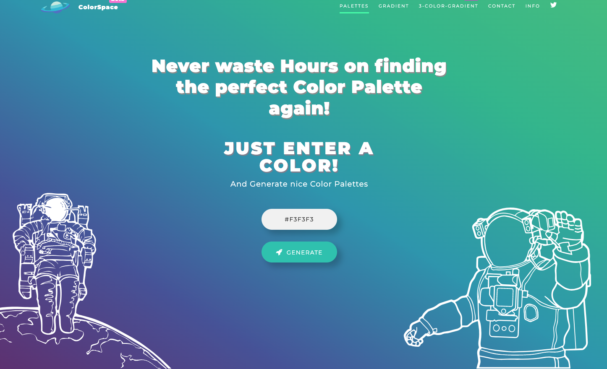
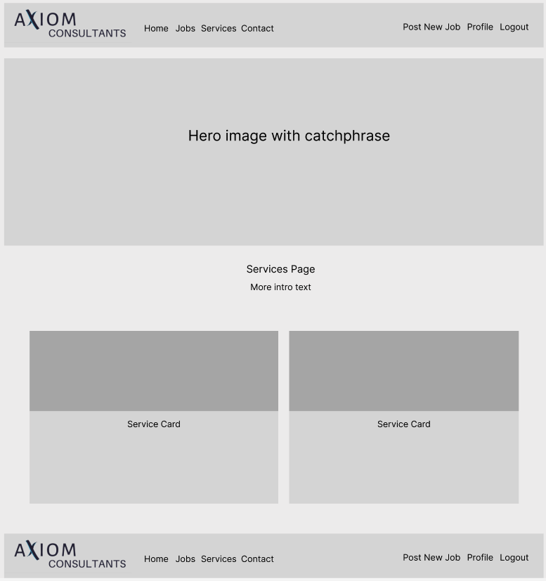
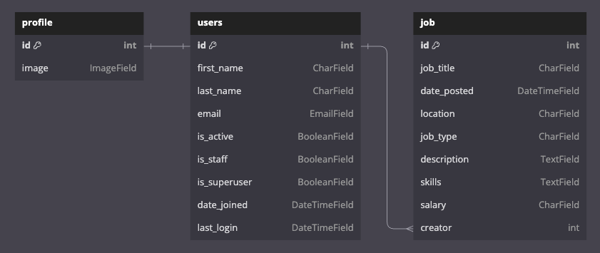
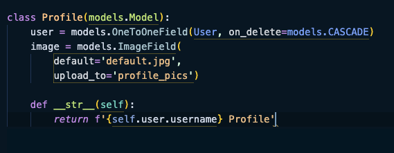

# Axiom Consultants

## Introduction

The Axiom Consultants website is designed to showcase the services of a real recruitment company. 

Users can register for the site, which will store their details.  This will provide CRUD functionality on their own job posts.

From the Home page users can peruse through an abbreviated description of services with the option of clicking through to more detailed descriptions on the services page.

On the Jobs page users can see a list of available jobs.  Each of these jobs can be selected and a more detailed view of the jobs is then displayed.  If the user is registered and logged in they are presented with the ability to post new jobs and edit/delete jobs they have already posted.  Users that have been designated as staff by the admin can edit/delete all posts.  Rich text editing functionality is provided to enhance the presentation of the job posts.

This project significantly enhances the functionality of the client’s existing site in a number of ways.  Firstly, their site is poorly formatted, not responsive and has very slow performance.  Also the client does not currently have any Content Management (CMS) capability to add their own job posts and incurs charges whenever a new job has to be posted, updated or removed.

The new site is completely responsive, has a sharp fresh design and allows complete CRUD capability to staff and limited CRUD capability to potential clients. 

There is significant potential to expand the site in the future to include, for example, a candidate database story CVs, the ability to apply for jobs and potentially post jobs to LinkedIn using their developer API.  Unfortunately, we weren’t able to gain access to that API at the point of completing the project.

## UX

### Colour Scheme

In discussion with the client it was agreed to use strong thematic images to provide visual impact on the pages so wanted neutral colours that would not clash with the images.  The Headers, Footers and card backgrounds use #D1D4D9 and the main body is in the lighter #F3F3F3 to provide contract through the sections.  The HTML is coloured white to provide a contrast to the edges of the website at larger screen sizes that exceed the maximum width that has been defined for the site.  These were matched using the [ColorSpace](https://mycolor.space/) palette matching website.

On the services page, where we have the detailed service descriptions, we have added a fixed background image to bring some dramatic impact to the pages as we have not used images on the detailed services cards.

### Typography

Having installed Bootstrap for this project, the default “native font stack” included in Bootstrap has been used.  This provides optimised fonts for the most popular device types and Operating Systems.  In addition these fonts are responsive and working will across the range of viewports defined within the framework.
[Bootstrap Typography](https://getbootstrap.com/docs/5.3/content/typography/)

## User Stories

### Site Users

- As a site user, I would like to view a list of recipes, so that I can select one to read, [

### Site Admin

### Product Owner

## Wireframes

Wireframes have been produced using [Figma](https://www.figma.com/file/O8JAL46OdCJH5ZrVO6Ie9x/Axiom?type=design&node-id=0%3A1&mode=design&t=9b1wHrEOAMbPun55-1)

### Home Page

### Jobs Page

### Services Page

### Contact Page

## Features

### Existing Features

- **Navigation**
    - The navigation bar is located both at the top and bottom of the screen
- **Home Page**
    - The home page
- **Jobs Page**
    - The home page
- **Services Page**
    - The home page
- **Contact Page**
    - The home page
- **Registration**
    - The home page
- **Login**
    - The home page
- **Profile**
    - The home page
- **Create a job posting**
    - The home page
- **Edit Job**
    - The home page
- **Delete Job**
    - The home page

### Future Features

- **Candidates database**
    - The navigation bar is located both at the top and bottom of the screen
- **Apply for job**
    - The home page
- **Job candidates**
    - The home page
- **Candidate and Jobs filtering**
    - The navigation bar is located both at the top and bottom of the screen
- **Integration with LinkedIn**
    - The home page
- **Insights Page**
    - The home page

## Tools & Technologies Used

- [HTML](https://en.wikipedia.org/wiki/HTML) used for the main site content.
- [CSS](https://en.wikipedia.org/wiki/CSS) used for the main site design and layout.
- [CSS Flexbox](https://www.w3schools.com/css/css3_flexbox.asp) used for an enhanced responsive layout.
- [CSS Grid](https://www.w3schools.com/css/css_grid.asp) used for an enhanced responsive layout.
- [JavaScript](https://www.javascript.com) used for user interaction on the site.
- [Python](https://www.python.org) used as the back-end programming language.
- [Git](https://git-scm.com) used for version control. (`git add`, `git commit`, `git push`)
- [GitHub](https://github.com) used for secure online code storage.
- [Gitpod](https://gitpod.io) used as a cloud-based IDE for development.
- [Bootstrap](https://getbootstrap.com) used as the front-end CSS framework for modern responsiveness and pre-built components.
- [Django](https://www.djangoproject.com) used as the Python framework for the site.
- [PostgreSQL](https://www.postgresql.org) used as the relational database management.
- [ElephantSQL](https://www.elephantsql.com) used as the Postgres database.
- [Heroku](https://www.heroku.com) used for hosting the deployed back-end site.
- [Cloudinary](https://cloudinary.com) used for online static file storage.
- [Gunicorn](https://gunicorn.org/) used as a server provider for the site.
- [dbdiagram.io](https://dbdiagram.io/) used to design database schema.

## Database Design

[PostgreSQL](https://www.postgresql.org) has been used as the relational database for deployment, hosted using [ElephantSQL](https://www.elephantsql.com).  To model the database I used [dbdiagram.io](https://dbdiagram.io/d/Axiom-65365b24ffbf5169f041a7be) to create the Entity Relationship Diagram to visualise the relationship between the 3 tables required.

- **users**
    - importing django user model
    - one to one relationship with profile table
    - one to many relationship 
- **profile**
    - custom model with one to one relationship with users table
    - has one field (other than ID) storage of profile image

- **job**
    - custom model for storage of job postings
    - many to one relationship with users table (many jobs per user)
    - Presets defined in model for job_type field.

## Agile Development Process

### GitHub Projects